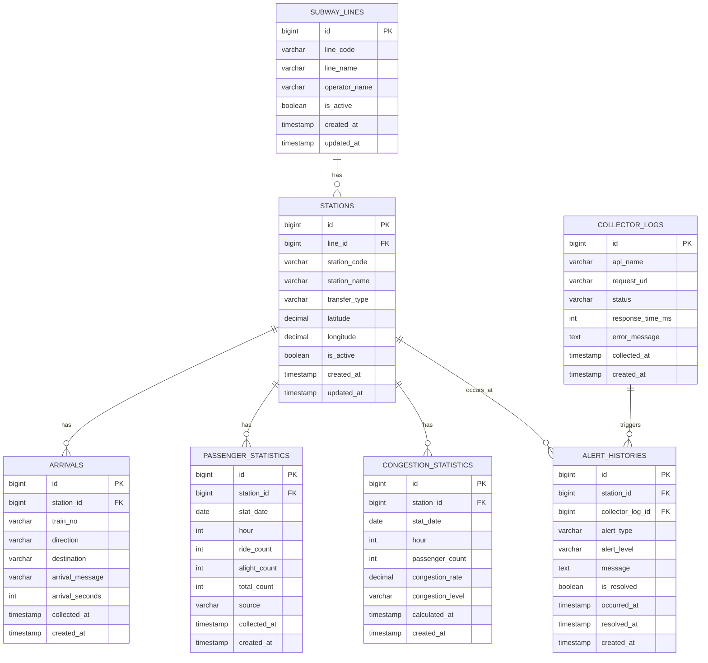

# ERD

## 1. 개요

MetroWatch는 공공데이터 기반 실시간 도시철도 운영·혼잡 관제 시스템이다.

본 문서는 다음 데이터를 저장하기 위한 데이터베이스 구조를 정의한다.

- 노선 정보
- 역사 정보
- 실시간 열차 도착 정보
- 역사별 승하차 통계
- 혼잡도 계산 결과
- 공공 API 수집 로그
- 알림 이력

---

## 2. ERD Diagram



---

## 3. 테이블 상세

## 3-1. subway_lines

노선 정보를 저장한다.

| 컬럼명 | 타입 | 설명 |
|---|---|---|
| id | bigint | PK |
| line_code | varchar | 노선 코드 |
| line_name | varchar | 노선명 |
| operator_name | varchar | 운영 기관 |
| is_active | boolean | 사용 여부 |
| created_at | timestamp | 생성 일시 |
| updated_at | timestamp | 수정 일시 |

---

## 3-2. stations

역사 정보를 저장한다.

| 컬럼명 | 타입 | 설명 |
|---|---|---|
| id | bigint | PK |
| line_id | bigint | 노선 ID |
| station_code | varchar | 역사 코드 |
| station_name | varchar | 역사명 |
| transfer_type | varchar | 환승 여부 |
| latitude | decimal | 위도 |
| longitude | decimal | 경도 |
| is_active | boolean | 사용 여부 |
| created_at | timestamp | 생성 일시 |
| updated_at | timestamp | 수정 일시 |

---

## 3-3. arrivals

실시간 열차 도착 정보를 저장한다.

> 실시간성 데이터이므로 Redis 캐시를 우선 사용하고, DB 저장은 이력 분석 또는 장애 추적 목적일 때만 사용한다.

| 컬럼명 | 타입 | 설명 |
|---|---|---|
| id | bigint | PK |
| station_id | bigint | 역사 ID |
| train_no | varchar | 열차 번호 |
| direction | varchar | 상행/하행 방향 |
| destination | varchar | 종착역 |
| arrival_message | varchar | 도착 메시지 |
| arrival_seconds | int | 도착 예정 시간 |
| collected_at | timestamp | 수집 일시 |
| created_at | timestamp | 생성 일시 |

---

## 3-4. passenger_statistics

역사별 시간대 승하차 통계 데이터를 저장한다.

| 컬럼명 | 타입 | 설명 |
|---|---|---|
| id | bigint | PK |
| station_id | bigint | 역사 ID |
| stat_date | date | 통계 기준일 |
| hour | int | 시간대 |
| ride_count | int | 승차 인원 |
| alight_count | int | 하차 인원 |
| total_count | int | 총 이용 인원 |
| source | varchar | 데이터 출처 |
| collected_at | timestamp | 수집 일시 |
| created_at | timestamp | 생성 일시 |

---

## 3-5. congestion_statistics

승하차 데이터를 기반으로 계산한 혼잡도 결과를 저장한다.

| 컬럼명 | 타입 | 설명 |
|---|---|---|
| id | bigint | PK |
| station_id | bigint | 역사 ID |
| stat_date | date | 기준일 |
| hour | int | 시간대 |
| passenger_count | int | 이용객 수 |
| congestion_rate | decimal | 혼잡률 |
| congestion_level | varchar | 혼잡 단계 |
| calculated_at | timestamp | 계산 일시 |
| created_at | timestamp | 생성 일시 |

혼잡 단계 예시:

| congestion_level | 설명 |
|---|---|
| LOW | 여유 |
| NORMAL | 보통 |
| HIGH | 혼잡 |
| VERY_HIGH | 매우 혼잡 |

---

## 3-6. collector_logs

공공 API 수집 로그를 저장한다.

| 컬럼명 | 타입 | 설명 |
|---|---|---|
| id | bigint | PK |
| api_name | varchar | API 이름 |
| request_url | varchar | 요청 URL |
| status | varchar | SUCCESS / FAIL |
| response_time_ms | int | 응답 시간 |
| error_message | text | 에러 메시지 |
| collected_at | timestamp | 수집 시각 |
| created_at | timestamp | 생성 일시 |

---

## 3-7. alert_histories

혼잡도 임계치 초과, API 장애, 데이터 이상 탐지 등의 알림 이력을 저장한다.

| 컬럼명 | 타입 | 설명 |
|---|---|---|
| id | bigint | PK |
| station_id | bigint | 역사 ID |
| collector_log_id | bigint | 수집 로그 ID |
| alert_type | varchar | 알림 유형 |
| alert_level | varchar | 알림 등급 |
| message | text | 알림 메시지 |
| is_resolved | boolean | 해결 여부 |
| occurred_at | timestamp | 발생 일시 |
| resolved_at | timestamp | 해결 일시 |
| created_at | timestamp | 생성 일시 |

---

## 4. 인덱스 설계

## stations

```sql
CREATE INDEX idx_stations_line_id ON stations(line_id);
CREATE INDEX idx_stations_station_code ON stations(station_code);
```

## arrivals

```sql
CREATE INDEX idx_arrivals_station_collected_at 
ON arrivals(station_id, collected_at DESC);
```

## passenger_statistics

```sql
CREATE INDEX idx_passenger_statistics_station_date_hour
ON passenger_statistics(station_id, stat_date, hour);
```

## congestion_statistics

```sql
CREATE INDEX idx_congestion_statistics_station_date_hour
ON congestion_statistics(station_id, stat_date, hour);

CREATE INDEX idx_congestion_statistics_level
ON congestion_statistics(congestion_level);
```

## collector_logs

```sql
CREATE INDEX idx_collector_logs_api_status
ON collector_logs(api_name, status);

CREATE INDEX idx_collector_logs_collected_at
ON collector_logs(collected_at DESC);
```

## alert_histories

```sql
CREATE INDEX idx_alert_histories_station_occurred_at
ON alert_histories(station_id, occurred_at DESC);

CREATE INDEX idx_alert_histories_resolved
ON alert_histories(is_resolved);
```

---

## 5. 설계 포인트

## 5-1. 실시간 데이터와 통계 데이터 분리

실시간 열차 도착 정보는 Redis 캐시를 우선 사용한다.

DB에는 필요한 경우에만 저장하여 다음 목적에 활용한다.

- 장애 추적
- 이력 분석
- 데이터 수집 상태 확인

---

## 5-2. 운영 로그 테이블 별도 관리

공공 API는 외부 의존성이 있으므로 장애 가능성이 존재한다.

따라서 `collector_logs` 테이블을 통해 다음 항목을 추적한다.

- API 호출 성공 여부
- 응답 시간
- 실패 사유
- 마지막 수집 시각

---

## 5-3. 혼잡도 계산 결과 저장

혼잡도는 조회 시마다 계산하지 않고, 배치 또는 스케줄러를 통해 계산 후 저장한다.

이를 통해:

- 조회 성능 개선
- 시간대별 추이 분석
- 관리자 대시보드 제공

이 가능하다.

---

## 5-4. 알림 이력 관리

API 장애, 혼잡도 임계치 초과, 데이터 이상 탐지 결과를 `alert_histories`에 저장한다.

이를 통해 운영자는 장애 발생 이력과 해결 여부를 추적할 수 있다.

---

## 6. 향후 확장 고려사항

추후 아래 테이블을 추가할 수 있다.

| 테이블 | 목적 |
|---|---|
| users | 관리자 계정 관리 |
| admin_audit_logs | 관리자 작업 이력 |
| weather_statistics | 날씨 데이터 연동 |
| train_positions | 실시간 열차 위치 |
| incident_reports | 장애/민원 신고 |
| notification_channels | Slack, Email 등 알림 채널 관리 |